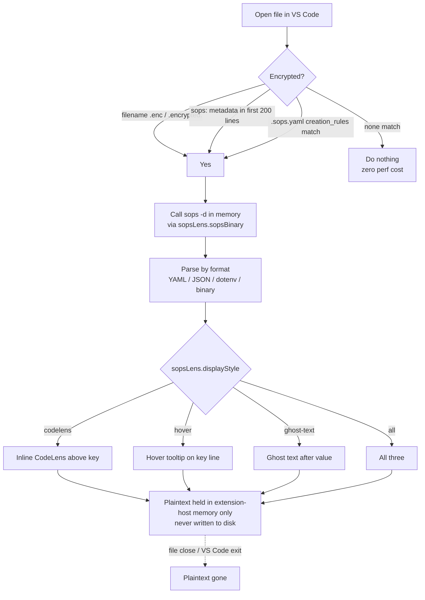

# sops-lens-vsc-ext

> VS Code extension that **reveals SOPS-encrypted file values in-editor** as CodeLens / hover tooltip / ghost-text decorations. Decrypts via the `sops` CLI in-memory. **Never writes plaintext to disk.**

[](https://github.com/chirag127/sops-lens/blob/main/LICENSE)
[](https://github.com/chirag127/sops-lens/stargazers)
[](https://github.com/chirag127/sops-lens/commits)
[](https://www.typescriptlang.org/)
[](https://code.visualstudio.com/)

## What it is / why it exists

Reading a [SOPS](https://github.com/getsops/sops)-encrypted file usually means running `sops -d .env.enc > .env`, which leaves plaintext secrets sitting on disk, in your terminal scrollback, and one `git add .` away from a leak. SOPS Lens removes that whole dance: open any SOPS-encrypted file and it renders the decrypted values right next to their ciphertext, decrypting in-memory through your existing `sops` setup. You read your secrets at a glance and the plaintext never lands on disk.

- **No disk leak** — the standard `sops -d .env.enc > .env` workflow writes plaintext to disk for the duration of editing. SOPS Lens skips that step; plaintext lives only in the editor process's memory, gone on file close or VS Code exit.
- **No terminal echo** — `sops decrypt --stdout` prints the secret to your terminal scrollback. SOPS Lens never does.
- **No git accidents** — there's no `.env` file to accidentally commit.

## Links

- Live site: **[sops-lens.oriz.in](https://sops-lens.oriz.in)** (the `site/` directory is the landing page)
- Repo: [github.com/chirag127/sops-lens](https://github.com/chirag127/sops-lens)
- GitHub Pages: [chirag127.github.io/sops-lens](https://chirag127.github.io/sops-lens/) serves the repo landing/about page. The Cloudflare domain (`sops-lens.oriz.in`) is the canonical live site.
- Marketplace: publisher `chirag127` — **install from source until Marketplace publish** (see [Install](#install)).

## ⭐ Star this repo

If this is useful, please ⭐ star the repo — it helps others find it.

## How it works



## Display modes

Configurable via `sopsLens.displayStyle`:

| Mode                 | What it looks like                                                                |
| -------------------- | --------------------------------------------------------------------------------- |
| `codelens` (default) | Inline CodeLens above each key: `🔓 dummy-value-123` — click to copy              |
| `hover`              | Hover over the key line → tooltip shows `KEY = decrypted_value`                   |
| `ghost-text`         | Ghost text after the encrypted value: `FOO_API_KEY: ENC[AES256...] → dummy-value` |
| `all`                | All three simultaneously                                                          |

## Features

- Inline reveal of SOPS secrets in four display styles (CodeLens / hover / ghost-text / all).
- In-memory decryption via the `sops` CLI — plaintext never touches disk.
- Virtual edit + re-encrypt: edit decrypted plaintext in a memory-only editor, save back re-encrypted (v0.2).
- Copy-to-clipboard with best-effort auto-clear after 30 seconds.
- Detects encrypted files three ways: filename, embedded `sops:` metadata, or a matching `.sops.yaml` rule.
- Supports YAML, JSON, dotenv, and binary blob previews.
- File-size guard (`sopsLens.maxFileSizeKB`) so it never runs `sops` on a giant binary by accident.

## Tech stack

- **TypeScript 5.6** compiled with `tsc` to `out/`
- **VS Code Extension API** (`^1.85.0`)
- **Biome** for lint/format
- **@vscode/vsce** for packaging (`.vsix`)
- **Dagger** (`dagger.json`) for reproducible CI build
- Static landing page under `site/` (built via `node site/build.mjs` with `marked`)

## Repo structure

```
sops-lens-vsc-ext/
├── src/               # TypeScript extension source (CodeLens / hover / ghost-text providers, sops runner)
├── out/               # Compiled JS (tsc output, extension entry: out/extension.js)
├── site/              # Landing page for sops-lens.oriz.in (build.mjs + marked)
├── package.json       # name "sops-lens", publisher chirag127, v0.2.0, contributes config + commands
├── dagger.json        # reproducible CI build module
├── biome.json         # lint/format config
└── LICENSE            # MIT
```

## Install

**From source (until published to Marketplace):**

```bash
git clone https://github.com/chirag127/sops-lens-vsc-ext.git
cd sops-lens-vsc-ext
npm install
npm run compile
npm run package    # produces sops-lens-0.2.0.vsix
code --install-extension sops-lens-0.2.0.vsix
```

**Once published**: search `SOPS Lens` in the VS Code extensions marketplace (publisher `chirag127`).

## Requirements

- `sops` binary on PATH (or set `sopsLens.sopsBinary` to its absolute path).
- Your sops setup (age key, `.sops.yaml`, etc.) configured so that `sops -d <file>` works in a terminal. The extension just calls that command.

## Configuration

| Setting                   | Purpose                                                                              |
| ------------------------- | ------------------------------------------------------------------------------------ |
| `sopsLens.displayStyle`   | How to display decrypted values: `codelens` \| `hover` \| `ghost-text` \| `all`      |
| `sopsLens.sopsBinary`     | Path to the `sops` binary. Defaults to `sops` (must be on PATH)                      |
| `sopsLens.decryptOnOpen`  | Decrypt on file open. If `false`, requires manual `SOPS Lens: Reveal`                |
| `sopsLens.maxFileSizeKB`  | Skip decryption for files larger than this (KB) — guard against running on binaries  |

## Commands

| Command                                    | What it does                                                                      |
| ------------------------------------------ | --------------------------------------------------------------------------------- |
| `SOPS Lens: Reveal`                        | Force-decrypt the active file + render                                            |
| `SOPS Lens: Hide`                          | Clear cache for active file + hide decorations                                    |
| `SOPS Lens: Refresh`                       | Re-decrypt everything (after editing keys / rotating)                             |
| `SOPS Lens: Copy decrypted value`          | Used by CodeLens click — copies to clipboard, auto-clears after 30 s              |
| `SOPS Lens: Edit decrypted (virtual view)` | **NEW v0.2** — opens decrypted plaintext in a virtual editor; never on disk       |
| `SOPS Lens: Save virtual (re-encrypt)`     | **NEW v0.2** — re-encrypts the virtual view back to the source .enc file via sops |

## Editing encrypted files

There's a `✏️ Edit decrypted (virtual view)` CodeLens at the top of every detected encrypted file. Click it OR run `SOPS Lens: Edit decrypted (virtual view)`:

1. A new editor opens with the decrypted plaintext. The URI scheme is `sops-lens-edit://` so VS Code marks it as untitled / unsaved.
2. Edit normally.
3. Run `SOPS Lens: Save virtual (re-encrypt)` to write back. The extension re-encrypts the edited plaintext via `sops encrypt` and atomically replaces the source `.enc` file.
4. Any open editor showing the source file auto-reverts from disk; CodeLens / hover / ghost-text refresh to the new values.

**Plaintext never touches disk** — the virtual document lives only in memory. The `.tmp` file used for atomic replace contains only the freshly-encrypted ciphertext, then is renamed to the source path.

## How it decides a file is encrypted

In order:

1. Filename ends in `.enc` or contains `.encrypted.`
2. File contents have a `sops:` / `"sops":` / `sops_version:` metadata marker in the first 200 lines
3. **NEW v0.2** — A nearby `.sops.yaml` (walked up from the file's directory, max 20 levels) has a `creation_rules` entry whose `path_regex` or `path_glob` matches the file's relative path

If none match, the extension does nothing. No performance cost on regular files.

## Supported encrypted file formats

- **YAML** (`.yaml.enc`, `.yml.enc`, or `.yaml` with a sops block) — line-by-line key/value parse
- **JSON** (`.json.enc`) — flattened key paths (e.g. `database.password`)
- **dotenv** (`.env.enc`, `.dotenv.enc`) — `KEY=VALUE` line parse
- **NEW v0.2: Binary** (`.bin.enc`, `.binary.enc`, or `.enc` files without a sops-yaml marker) — read-only blob preview. UTF-8 text shown when printable; otherwise hex head + byte count. Click to copy the full decoded blob.

## Security

- **No secrets in this repo.** The extension calls your existing `sops`+`age` setup; `PUBLIC_*`-style values are client-only.
- Plaintext lives in the **VS Code extension host process memory** for the editor session. A core dump of VS Code while a file is open would expose it. Standard secret-management trade-off.
- Clipboard copy auto-clears after **30 seconds** (best-effort — if you copy something else in between, the timer leaves the new clipboard alone).
- The extension **never writes plaintext to disk**. The only on-disk trace is `sops` CLI's own temp files (which it creates + deletes during its own decryption pipeline — out of our control).
- If your `.sops.yaml` lists multiple age recipients, the extension uses whichever age key is available in the standard `SOPS_AGE_KEY_FILE` / `SOPS_AGE_KEY` env (your normal sops setup).

## Part of the oriz family

SOPS Lens is one of ~80 sites and tools in the **oriz** family. See [blog.oriz.in](https://blog.oriz.in) for the rest.

Related:

- [`chirag127/secrets`](https://github.com/chirag127/secrets) — the private family secrets store this extension makes pleasant to browse
- [`chirag127/workspace`](https://github.com/chirag127/workspace) — umbrella; see `knowledge/services/security/sops.md` and `age.md` for the broader stack

## Contributing

Issues and PRs welcome. Conventional commits are the changelog.

## License

MIT © Chirag Singhal. See [LICENSE](./LICENSE).

## Author

Chirag Singhal · [chirag@oriz.in](mailto:chirag@oriz.in)

## Status / roadmap

**Stable** at v0.2.0 (virtual edit + re-encrypt, binary previews, `.sops.yaml` rule matching). Next: Marketplace publish under publisher `chirag127`.
